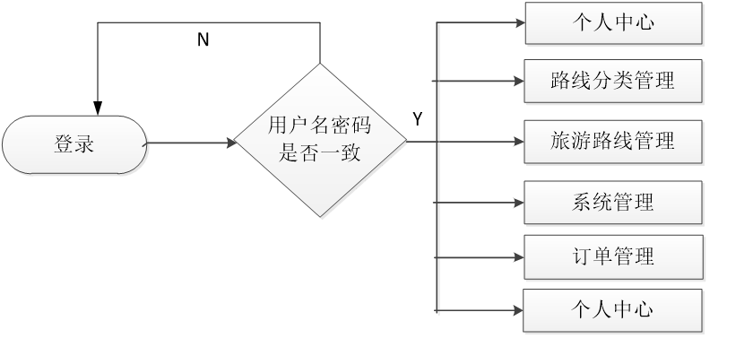
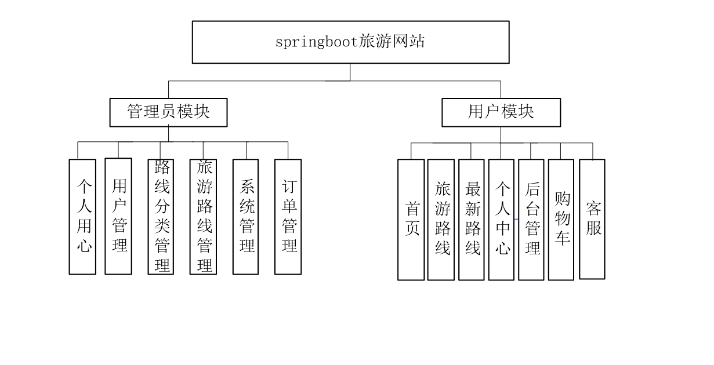
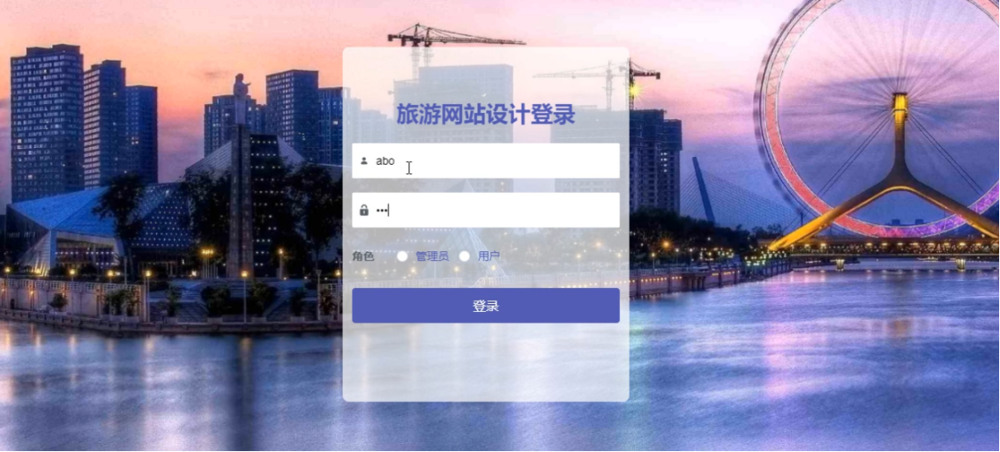
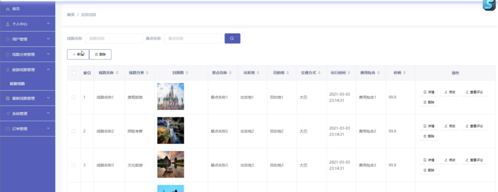
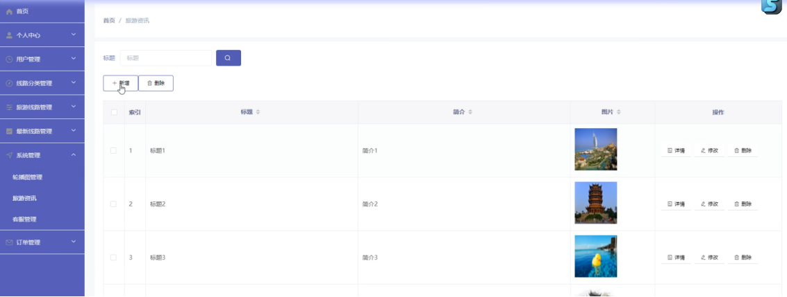
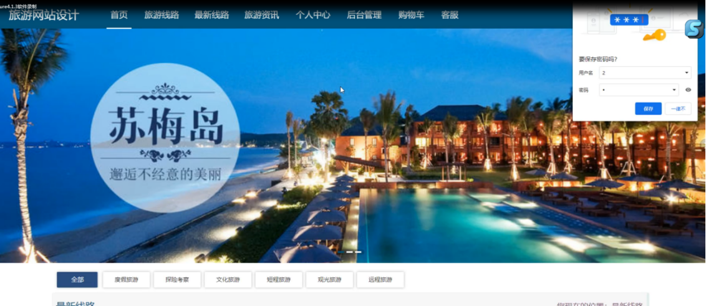
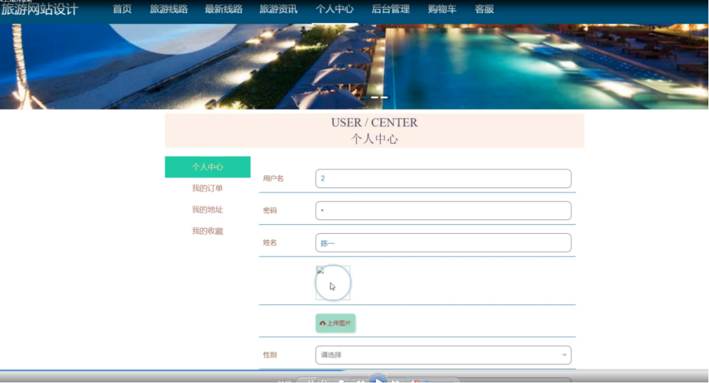
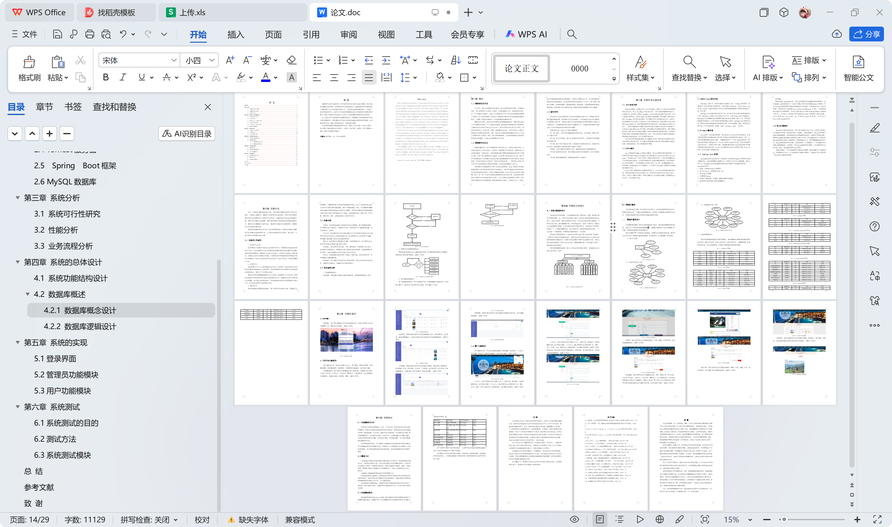

# springboot013-基于SpringBoot的旅游网站的设计与实现

>  博主介绍：
>  Hey，我是程序员Chaers，一个专注于计算机领域的程序员
>  十年大厂程序员全栈开发‍ 日常分享项目经验 解决技术难题与技术推荐 承接各类网站设计，小程序开发，毕设等。
>  【计算机专业课程设计，毕业设计项目，Java，微信小程序，安卓APP都可以做，不仅仅是计算机专业，其它专业都可以】

## 本项目获取地址：https://www.bishecode.com/product/12/

## 3000套系统可挑选，获取链接：https://www.bishecode.com/

### 系统架构

> 前端：html | js | css | jquery | vue
>
> 后端：springboot | mybatis
> 
> 环境：jdk1.8+ | mysql | maven

# 一、内容包括
包括有  项目源码+项目论文+数据库源码+答辩ppt+远程调试成功

# 二、运行环境

> jdk版本：1.8 及以上； ide工具：IDEA； 数据库: mysql5.7及以上；编程语言: Java

# 三、需求分析

**3.1 系统可行性研究**

1、经济可行性分析

旅游网站的开发是由开发者自己设计研究所开发，不需要购买其他软件或者端口之类的，而且在系统的开发之前所做的市场调研及其他的旅游管理相关系统，都是没有任何费用的，都是通过开发者自己的努力，所有的工作都是自己亲力亲为，在碰到自己比较难以解决的问题，大多是通过同学和指导老师的帮助进行相关信息的解决，所以对于旅游网站的开发在经济上是完全可行的，没有任何费用支出的。

2、技术可行性

本旅游网站在Windows操作系统中进行开发，并且目前PC机的性能已经可以胜任普通旅游网站系统的web服务器。旅游网站系统的开发所使用的技术也都是自身所具有的，也是当下广泛应用的技术之一。
系统的开发环境和配置都是可以自行安装的，系统使用JSP开发技术，使用比较成熟的开发环境进行对功能的实现及程序的交互，根据技术语言对开发环境的安装管理，结合需求进行修改维护，可以使得旅游网站运行更具有稳定性和安全性，从而完成实现网上旅游网站的开发。

3、操作可行性

旅游网站系统的界面简单易操作，用户只要平时有在用过电脑，都能进行访问和操作。计算机网络使人们的生活更快捷更有效率。在这个飞速发展的社会里，人们对工作效率的要求越来越高，操作性也越来越强。因此，以计算机和计算机网络为基础的管理系统是社会发展的必然趋势。日新月异的智能软件使我们逐渐从原来的手工操作转变为现在的人工智能。该系统操作简单，管理方便，交互性强，操作简单。因此，该系统在操作上是非常可行的。

**3.2 性能分析**

实用性：旅游网站系统基于市场研究开发的实际需要，用户界面清晰易懂，符合使用人员的功能需求。当使用太多人时，服务器会产生大量的数据流量，响应时间会有一些延迟。
平台安全：旅游网站是开放性的操作系统平台,不涉及付款及其他支付的功能,所以不涉及资金的往来,该系统主要是工作人员来管理平台上的内容便于传输和保存数据,数据备份功能将不会透露任何信息。
稳定性：旅游网站开发系统操作必须有一定程度的稳定性，设计使用安全技术及开发环境进行数据传输，稳定性极佳。
可伸缩性：每个程序的开发过程，不是一蹴而就的，在使用用户的过程中，会有很多不完善的地方，需要改进功能，重新添加新功能等等，这就需要程序的可扩展性、各种功能模块的开发以及独立开发的可行性。
响应性：该系统能够快速响应用户的请求，返回正确、实时的有效信息，尽可能避免失速和碰撞问题。
处理能力：对于系统的异常可以进行有效的处理，可以在异常发生后及时备份，恢复到以前的状态，对数据不进行破坏或修改。

**3.3 业务流程分析**

1、登录流程图如下：

登录流程，系统登录必须输入正确的登录信息。登录流程图如图所示。

2、管理员后台管理流程图如下：
管理员通过登录成功进入到系统操作界面，可以根据系统界面的功能模块，管理员进行修改维护等操作。如图所示。

# 四、功能模块

架构设计的目的是反映一个结构和其他元素之间的关系，抽象，通常用于指导大型软件系统。将一个巨大的任务细分为多个小任务的过程是系统架构的总体设计。完成小任务后，整个任务就可以完成了。具体的实现过程是分解系统，分析各部分的功能、接口和逻辑关系。信息传递的设计，最后一步是优化，系统的大体功能靠两部分展现，它们分别是前端平台和后端平台，应用MVC开发框架，页面是一个一个模块组建而成的，层次结构分明，思想运用的是面向对象，一个实体对应一个数据类型，还要对每个数据类添加一个实施类。架构设计的用途是反映一个结构内的元素与别的元素之间的关系，有抽象性，一般用于为大型软件系统提供指导。将庞大的任务具体细分为多个小人物的过程就是系统架构的整体设计，对细小任务进行整合后就可以完成整个任务，具体实现过程是分解系统，对各个部分的功能、界面和逻辑关系、信息传输予以设计，最后是进行逐步的优化。用户拥有最高管理权限。通过以上需求分析的调查与研究，将系统的总体功能定义如下图所示。

# 五、部分效果图展示
图5-1登录窗口界面【登录窗口，用户通过登录窗口可以进行登录或注册。还没注册的用户可以进行填写用户名、密码进行注册操作】

图5-2旅游路线界面【旅游路线管理：通过列表可以获取路线名称、路线分类、封面图、景点名称、出发地、目的地、交通方式、出行时间、费用包含、价格等信息，进行查看旅游详情或修改、查看评论操作，或新增、删除，如图】

图5-3旅游资讯界面【旅游资讯：管理员通过列表可以进行查看标题、简介、图片等信息，进行详情、修改或删除操作，并通过新增进行添加旅游资讯信息或删除操作，如图】

图5-4前台首页界面【用户登录成功后，可以进行查看旅游路线、最新线路、旅游资讯、个人中心、后台管理、购物车、客服等功能模块。进行相对应操作】

图5-5个人中心界面【个人中心：通过列表可以进行查看个人中心、我的订单、我的地址、我的收藏等功能，进行相对应操作，个人中心：通过页面可以进行修改用户名、密码、姓名、头像、性别、联系电话、余额等信息，进行更新信息操作，如图】

 <b>完整文章</b>

 

## 本项目获取地址：https://www.bishecode.com/product/12/

## 3000套系统可挑选，获取链接：https://www.bishecode.com/

